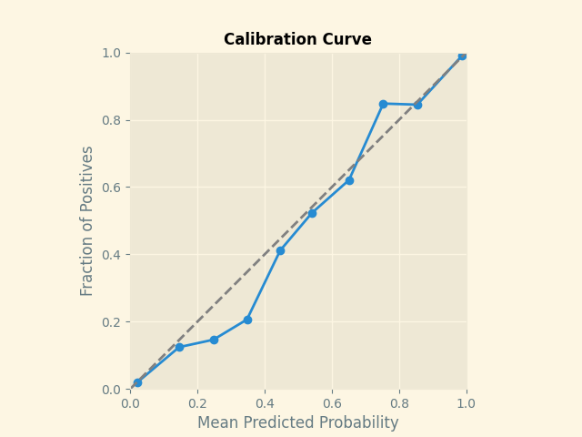
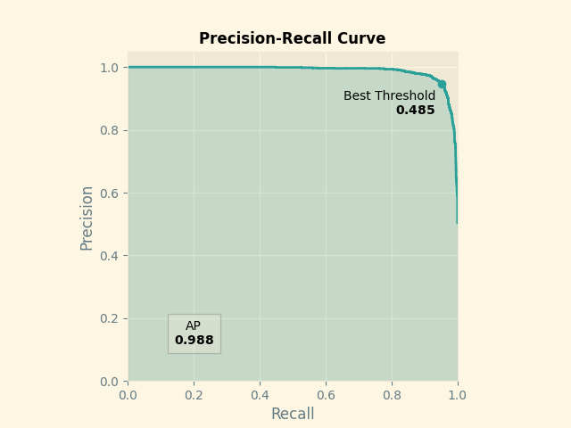
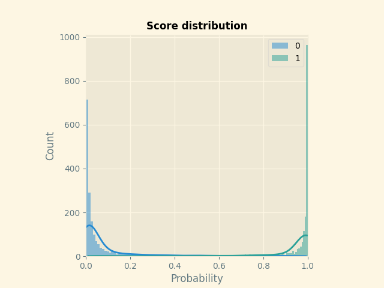

# Model Description

The model predicts the probability that a URL is a phishing site.  
To understand what phishing is, refer to the Wikipedia page:  
[https://en.wikipedia.org/wiki/Phishing](https://en.wikipedia.org/wiki/Phishing)
-- this is not a phishing link 😜

- **Model type:** LinearSVM
- **Task:** Binary classification
- **License:** MIT
- **Repository:** https://github.com/pirocheto/phishing-url-detection

## Evaluation

| Metric    | Value    |
| --------- | -------- |
| roc_auc   | 0.986002 |
| accuracy  | 0.949364 |
| f1        | 0.94867  |
| precision | 0.961853 |
| recall    | 0.935843 |

# How to Get Started with the Model

Using pickle in Python is discouraged due to security risks during data deserialization, potentially allowing code injection.
It lacks portability across Python versions and interoperability with other languages.
Read more about this subject in the [Hugging Face Documentation](https://huggingface.co/docs/hub/security-pickle).

Instead, we recommend using the ONNX model, which is more secure.
In addition to being lighter and faster, it can be utilized by languages supported by the [ONNX runtime](https://onnxruntime.ai/docs/get-started/).

Below are some examples to get you start. For others languages please refer to the ONNX documentation

<details>
  <summary><b>Python</b> - ONNX - [recommended 👍]
  </summary>

```python
import numpy as np
import onnxruntime
from huggingface_hub import hf_hub_download

REPO_ID = "pirocheto/phishing-url-detection"
FILENAME = "model.onnx"
model_path = hf_hub_download(repo_id=REPO_ID, filename=FILENAME)

# Initializing the ONNX Runtime session with the pre-trained model
sess = onnxruntime.InferenceSession(
    model_path,
    providers=["CPUExecutionProvider"],
)

urls = [
    "https://en.wikipedia.org/wiki/Phishing",
    "http//weird-website.com",
]
inputs = np.array(urls, dtype="str")

# Using the ONNX model to make predictions on the input data
results = sess.run(None, {"inputs": inputs})[1]

for url, proba in zip(urls, results):
    print(f"URL: {url}")
    print(f"Likelihood of being a phishing site: {proba[1] * 100:.2f} %")
    print("----")


```

</details>

<details>
  <summary><b>NodeJS</b>- ONNX - [recommended 👍]</summary>

```javascript
const ort = require("onnxruntime-node");

async function main() {
  try {
    // Make sure you have downloaded the model.onnx
    // Creating an ONNX inference session with the specified model
    const model_path = "./model.onnx";
    const session = await ort.InferenceSession.create(model_path);

    const urls = [
      "https://en.wikipedia.org/wiki/Phishing",
      "http//weird-website.com",
    ];

    // Creating an ONNX tensor from the input data
    const tensor = new ort.Tensor("string", urls, [urls.length]);

    // Executing the inference session with the input tensor
    const results = await session.run({ inputs: tensor });
    const probas = results["probabilities"].data;

    // Displaying results for each URL
    urls.forEach((url, index) => {
      const proba = probas[index * 2 + 1];
      const percent = (proba * 100).toFixed(2);

      console.log(`URL: ${url}`);
      console.log(`Likelihood of being a phishing site: ${percent}%`);
      console.log("----");
    });
  } catch (e) {
    console.log(`failed to inference ONNX model: ${e}.`);
  }
}

main();
```

</details>

<details>
  <summary><b>JavaScript</b> - ONNX - [recommended 👍]</summary>

```html
<!DOCTYPE html>
<html>
  <header>
    <title>Get Started with JavaScript</title>
  </header>
  <body>
    <!-- import ONNXRuntime Web from CDN -->
    <script src="https://cdn.jsdelivr.net/npm/onnxruntime-web/dist/ort.min.js"></script>
    <script>
      // use an async context to call onnxruntime functions.
      async function main() {
        try {
          const model_path = "./model.onnx";
          const session = await ort.InferenceSession.create(model_path);

          const urls = [
            "https://en.wikipedia.org/wiki/Phishing",
            "http//weird-website.com",
          ];

          // Creating an ONNX tensor from the input data
          const tensor = new ort.Tensor("string", urls, [urls.length]);

          // Executing the inference session with the input tensor
          const results = await session.run({ inputs: tensor });
          const probas = results["probabilities"].data;

          // Displaying results for each URL
          urls.forEach((url, index) => {
            const proba = probas[index * 2 + 1];
            const percent = (proba * 100).toFixed(2);

            document.write(`URL: ${url} <br>`);
            document.write(
              `Likelihood of being a phishing site: ${percent} % <br>`
            );
            document.write("---- <br>");
          });
        } catch (e) {
          document.write(`failed to inference ONNX model: ${e}.`);
        }
      }
      main();
    </script>
  </body>
</html>
```

</details>

<details>
  <summary><b>Python</b> - Pickle - [not recommended ⚠️]</summary>

```python
import joblib
from huggingface_hub import hf_hub_download

REPO_ID = "pirocheto/phishing-url-detection"
FILENAME = "model.pkl"

# Download the model from the Hugging Face Model Hub
model_path = hf_hub_download(repo_id=REPO_ID, filename=FILENAME)

urls = [
    "https://en.wikipedia.org/wiki/Phishing",
    "http//weird-website.com",
]

# Load the downloaded model using joblib
model = joblib.load(model_path)

# Predict probabilities for each URL
probas = model.predict_proba(urls)

for url, proba in zip(urls, probas):
    print(f"URL: {url}")
    print(f"Likelihood of being a phishing site: {proba[1] * 100:.2f} %")
    print("----")

```

</details>

# Plots






